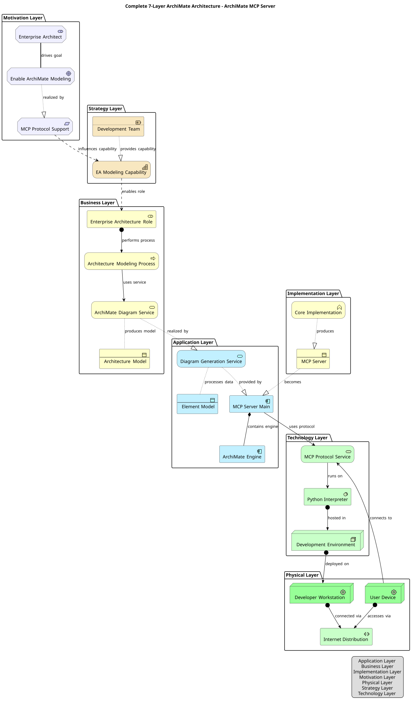
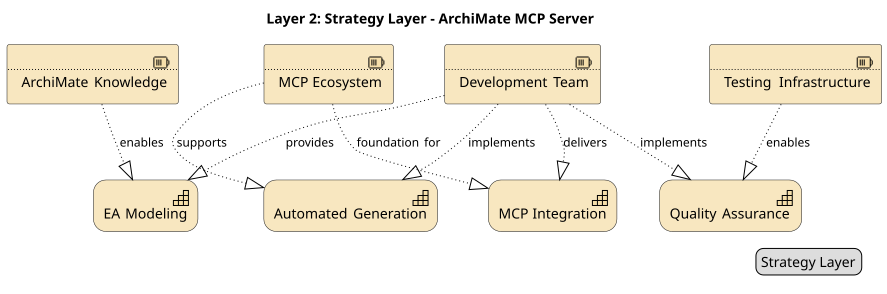
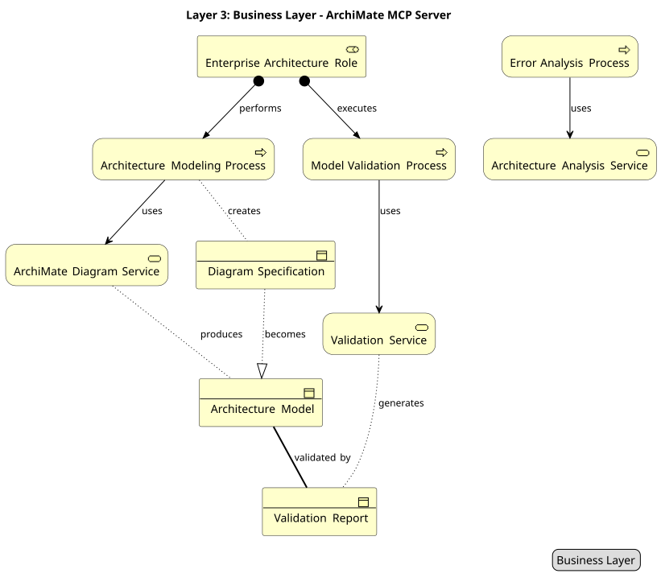
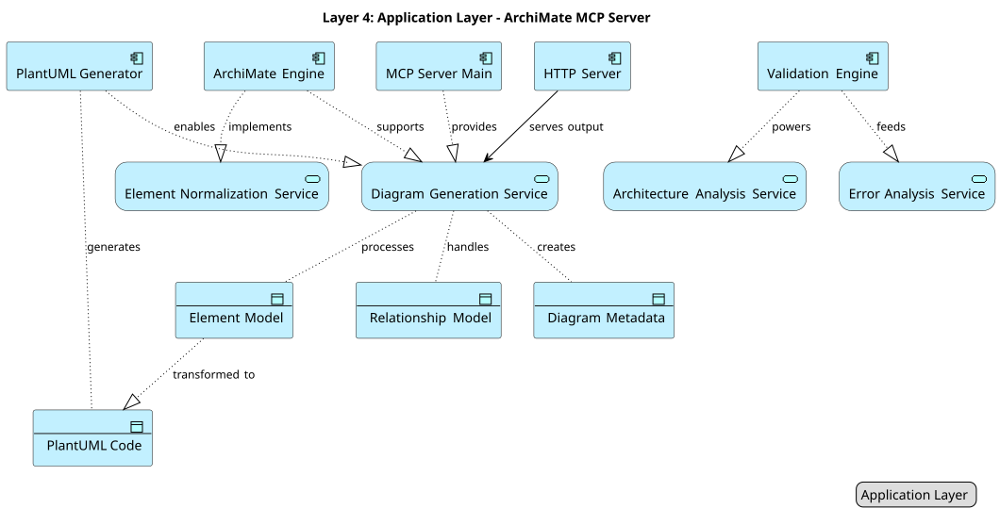
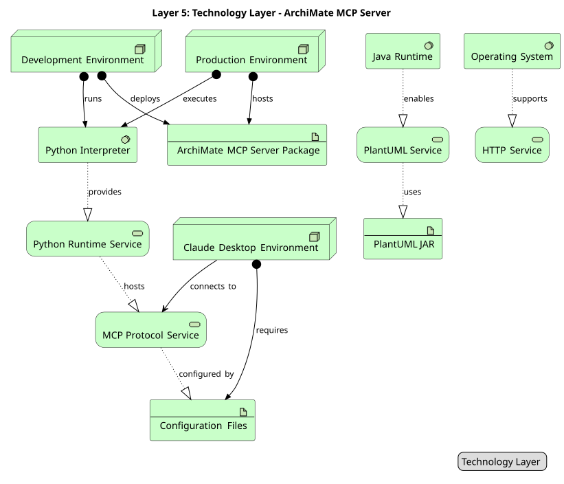
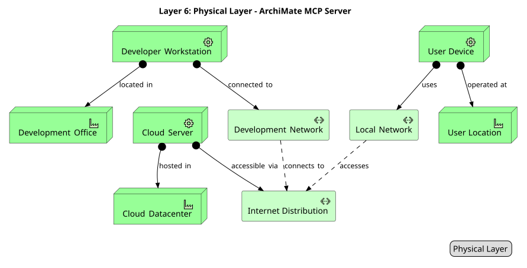
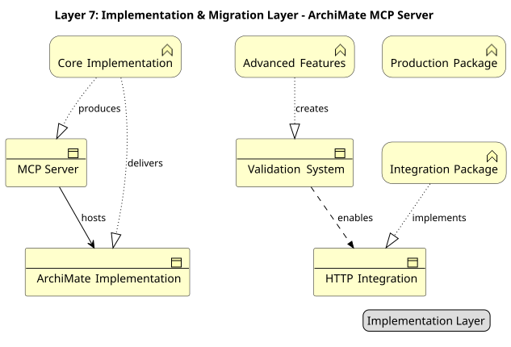

# ArchiMate MCP Server

[](https://www.python.org/downloads/)
[](https://opensource.org/licenses/MIT)
[](https://github.com/astral-sh/uv)
[](https://github.com/jlowin/fastmcp)
[](https://www.opengroup.org/archimate-forum/archimate-overview)
[](https://plantuml.com/)
[](https://modelcontextprotocol.io/)
[](#-development)
[](#-development)
[](#-overview)

A specialized MCP (Model Context Protocol) server for generating PlantUML ArchiMate diagrams with comprehensive enterprise architecture modeling support.

> **🎯 Live Architecture Demo**: This repository includes a complete architectural blueprint of the ArchiMate MCP Server itself, spanning all 7 ArchiMate layers with 8 coordinated views. See the generated diagrams below for a real-world demonstration of the tool's capabilities.

## 🏗️ Overview

ArchiMate MCP Server fills a crucial gap in the MCP ecosystem by providing dedicated support for ArchiMate enterprise architecture modeling. While existing MCP servers offer general UML diagram generation, this server focuses specifically on ArchiMate 3.2 specification compliance with full support for all layers, elements, and relationships.

### Key Features

- **Complete ArchiMate 3.2 Support**: All 55+ elements across **100% of 7 layers** (Motivation, Strategy, Business, Application, Technology, Physical, Implementation)
- **Universal PlantUML Generation**: All layers now supported with official PlantUML ArchiMate sprites and syntax
- **Intelligent Input Normalization**: Case-insensitive inputs with automatic correction and helpful error messages
- **Built-in Validation**: Comprehensive 4-step validation pipeline with real-time error detection
- **macOS-Optimized PNG/SVG Generation**: Headless mode prevents cursor interference + live HTTP server for instant viewing
- **4 Essential MCP Tools**: Core diagram creation with intelligent error analysis and architecture health assessment
- **Real-time Error Analysis**: Actionable troubleshooting guidance with pattern recognition and fix suggestions
- **FastMCP 2.8+ Integration**: Modern MCP protocol implementation with comprehensive schema discovery
- **Production-Ready Testing**: 182 passing tests with 70% coverage and comprehensive test suites across all layers
- **Multi-Language Support**: Automatic language detection (Slovak/English) with customizable relationship labels
- **Advanced Layout Control**: Configurable direction, spacing, grouping with environment variable defaults

## 🚀 Quick Start

### Installation

```bash
# Install with uv (recommended)
uv add archi-mcp

# Or install with pip
pip install archi-mcp
```

### Claude Desktop Configuration

**Setup**: Add to your Claude Desktop configuration file:

**macOS**: `~/Library/Application Support/Claude/claude_desktop_config.json`
**Windows**: `%APPDATA%\Claude\claude_desktop_config.json`

```json
{
  "mcpServers": {
    "archi-mcp": {
      "command": "uv",
      "args": ["run", "--directory", "/path/to/your/archi-mcp", "python", "-m", "archi_mcp.server"],
      "cwd": "/path/to/your/archi-mcp",
      "env": {
        "ARCHI_MCP_LOG_LEVEL": "INFO",
        "ARCHI_MCP_STRICT_VALIDATION": "true",
        "ARCHI_MCP_LANGUAGE": "auto",
        "ARCHI_MCP_DEFAULT_DIRECTION": "top-bottom",
        "ARCHI_MCP_DEFAULT_SPACING": "comfortable",
        "ARCHI_MCP_DEFAULT_TITLE": "true",
        "ARCHI_MCP_DEFAULT_LEGEND": "false",
        "ARCHI_MCP_DEFAULT_GROUP_BY_LAYER": "false",
        "ARCHI_MCP_DEFAULT_SHOW_RELATIONSHIP_LABELS": "true",
        "ARCHI_MCP_LOCK_DIRECTION": "false",
        "ARCHI_MCP_LOCK_SPACING": "false",
        "ARCHI_MCP_LOCK_TITLE": "false",
        "ARCHI_MCP_LOCK_LEGEND": "false",
        "ARCHI_MCP_LOCK_GROUP_BY_LAYER": "false",
        "ARCHI_MCP_LOCK_SHOW_RELATIONSHIP_LABELS": "false"
      }
    }
  }
}
```

**Environment Variables:**
- **ARCHI_MCP_LANGUAGE**: Language for relationship labels (`auto`, `en`, `sk`). Default: `auto` (detects from content)
- **ARCHI_MCP_DEFAULT_DIRECTION**: Default layout direction (`top-bottom`, `left-right`, `vertical`, `horizontal`). Default: `top-bottom`
- **ARCHI_MCP_DEFAULT_SPACING**: Default element spacing (`compact`, `balanced`, `comfortable`). Default: `comfortable`
- **ARCHI_MCP_DEFAULT_TITLE**: Show title by default (`true`/`false`). Default: `true`
- **ARCHI_MCP_DEFAULT_LEGEND**: Show legend by default (`true`/`false`). Default: `false`
- **ARCHI_MCP_DEFAULT_GROUP_BY_LAYER**: Group elements by layer by default (`true`/`false`). Default: `false`
- **ARCHI_MCP_DEFAULT_SHOW_RELATIONSHIP_LABELS**: Show enhanced relationship labels (`true`/`false`). Default: `true`
- **ARCHI_MCP_LOCK_***: Lock specific parameters to prevent client override (`true`/`false`). Default: `false`


### Basic Usage

Once configured, you can use ArchiMate MCP Server through Claude Desktop:

**Diagram Generation:**
```
Create a simple service-oriented diagram with:
- A customer facing business service
- An application service implementing it
- A supporting technology node
Show how the layers interact.
```

The full architecture generator follows the **ArchiMate Cookbook methodology** and automatically creates multiple coordinated views with proper element relationships and business domain context.

## 🏛️ Complete Architecture Demonstration

This repository showcases comprehensive architectural documentation of the ArchiMate MCP Server itself, spanning all 7 ArchiMate layers with **production-ready diagrams**. Each layer is fully supported with complete PlantUML generation:

### 🎯 **Complete Layered Architecture Overview**

*Comprehensive view showing key elements from all 7 ArchiMate layers with cross-layer relationships*

### 🎯 **Motivation Layer** 

*Stakeholders, drivers, goals, and requirements driving the ArchiMate MCP Server implementation*
- **Stakeholders**: Enterprise Architect, Software Developer, Claude Desktop User
- **Drivers**: Architecture Complexity, ArchiMate Compliance, Modeling Automation, AI Integration Demand
- **Goals**: Enable ArchiMate Modeling, Claude Integration, High Quality Diagrams, Comprehensive Validation
- **Requirements**: MCP Protocol Support, ArchiMate 3.2 Support, PlantUML Generation, Real-time Error Analysis

### 📋 **Strategy Layer**

*Strategic resources, capabilities, and courses of action for the ArchiMate MCP Server*
- **Resources**: ArchiMate IP Knowledge, Development Team, MCP Ecosystem, Testing Infrastructure
- **Capabilities**: Enterprise Architecture Modeling, Automated Diagram Generation, MCP Protocol Integration, Quality Assurance
- **Courses of Action**: Open Source Strategy, MCP-First Strategy, Standards Compliance Strategy, Continuous Testing Strategy

### 🏢 **Business Layer**

*Business actors, processes, services, and objects for architecture modeling*
- **Business Actor**: Enterprise Architecture Role (responsible for creating and maintaining enterprise architecture models)
- **Business Processes**: Architecture Modeling Process, Model Validation Process, Error Analysis Process
- **Business Services**: ArchiMate Diagram Service, Architecture Analysis Service, Validation Service
- **Business Objects**: Architecture Model, Diagram Specification, Validation Report

### 💻 **Application Layer**

*Application components, services, and data objects implementing the MCP server*
- **Components**: MCP Server Main, ArchiMate Engine, PlantUML Generator, Validation Engine, HTTP Server
- **Services**: Diagram Generation Service, Architecture Analysis Service, Element Normalization Service, Error Analysis Service
- **Data Objects**: Element Model, Relationship Model, PlantUML Code, Diagram Metadata

### ⚙️ **Technology Layer**

*Technology services, system software, nodes, and artifacts supporting the MCP server*
- **Technology Services**: MCP Protocol Service, PlantUML Service, Python Runtime Service, HTTP Service
- **System Software**: Python Interpreter (3.11+), Java Runtime, Operating System
- **Nodes**: Development Environment, Production Environment, Claude Desktop Environment
- **Artifacts**: ArchiMate MCP Server Package, PlantUML JAR, Configuration Files

### 🏗️ **Physical Layer**

*Physical equipment, facilities, and distribution networks supporting the ArchiMate MCP Server*
- **Equipment**: Developer Workstation, Cloud Server, User Device
- **Facilities**: Development Office, Cloud Datacenter, User Location
- **Distribution Networks**: Development Network, Internet Distribution, Local Network

### 🚀 **Implementation & Migration Layer**

*Work packages, deliverables, plateaus, and implementation events for the ArchiMate MCP Server rollout*
- **Work Packages**: Core MCP Implementation, Advanced Features Package, Integration Package, Production Release Package
- **Deliverables**: MCP Protocol Implementation, ArchiMate Engine, Validation Framework, HTTP Server Integration, Test Suite
- **Plateaus**: Development Plateau, Feature Complete Plateau, Integration Plateau, Production Plateau
- **Events**: Project Start, Core Milestone, Feature Milestone, Release Event

> **💡 Complete ArchiMate 3.2 Coverage**: All 7 layers successfully generated using the ArchiMate MCP Server itself, demonstrating 100% layer support and production readiness.

## 🏛️ ArchiMate Support

### Supported Layers

- **Business Layer**: Actors, roles, processes, services, objects
- **Application Layer**: Components, services, interfaces, data objects
- **Technology Layer**: Nodes, devices, software, networks, artifacts
- **Physical Layer**: Equipment, facilities, distribution networks, materials
- **Motivation Layer**: Stakeholders, drivers, goals, requirements, principles
- **Strategy Layer**: Resources, capabilities, courses of action, value streams
- **Implementation Layer**: Work packages, deliverables, events, plateaus, gaps

### Supported Relationships

All 12 ArchiMate relationship types with directional variants:
- Access, Aggregation, Assignment, Association
- Composition, Flow, Influence, Realization
- Serving, Specialization, Triggering

### Junction Support

- And/Or junctions for complex relationship modeling
- Grouping and nesting capabilities

## 🛠️ MCP Tools

The server exposes five core tools via FastMCP:

### 1. **create_archimate_diagram**
Generate complete ArchiMate diagrams from structured input with:
- Support for all 55+ element types across 7 layers
- All 12 ArchiMate relationship types with directional support
- Intelligent input normalization and validation
- PNG/SVG generation with HTTP server URLs
- Comprehensive layout configuration options

### 2. **analyze_current_architecture**
Analyze current architecture state and provide insights:
- Element and relationship statistics by layer
- Architecture completeness assessment
- Layer distribution analysis
- Model health indicators

### 3. **test_element_normalization**
Test element type normalization across all ArchiMate layers:
- Validates case-insensitive input handling
- Tests common element type mappings
- Verifies layer and relationship normalization
- Essential for troubleshooting input issues

### 4. **create_architecture_views_summary**
Create comprehensive markdown summary of all architectural views from current session:
- Scans exports directory for all generated diagrams
- Creates unified summary document with metadata and statistics
- Links to all successful architectural views with timestamps
- Optional inclusion of failed attempts for debugging
- Perfect for documentation, stakeholder sharing, and project handoffs

### 5. **analyze_recent_errors**
Analyze recent diagram generation errors with actionable guidance:
- Real-time error detection and pattern recognition
- Categorized error reporting (Empty Model, Orphaned Relationships, System Errors)
- Contextual troubleshooting recommendations
- Configurable time window analysis (1-60 minutes)

### ArchiMate Viewpoints
- **Layered**: Cross-layer relationships and dependencies
- **Service Realization**: How services are realized by components
- **Application Cooperation**: Application component interactions
- **Technology Usage**: Infrastructure and technology stack
- **Motivation**: Stakeholders, drivers, goals, and requirements

### Architecture Patterns
- **Three-Tier Architecture**: Presentation, business logic, data layers
- **Microservices**: Service-oriented architecture with API gateway
- **Event-Driven**: Event producers, consumers, and message flows
- **Layered Service**: Service-oriented layered architecture
- **CQRS**: Command Query Responsibility Segregation pattern

## 🧪 Development

### Requirements

- Python 3.11+
- uv (recommended) or pip
- Git

### Development Setup

```bash
# Clone the repository
git clone https://github.com/pskovajsa/archi-mcp.git
cd archi-mcp

# Install development dependencies
uv sync --dev

# Run tests
uv run pytest

# Run tests with coverage
uv run pytest --cov=archi_mcp --cov-report=html

# Code formatting
uv run black src tests
uv run isort src tests

# Type checking
uv run mypy src

# Linting
uv run ruff src tests
```

### Project Structure

```
archi-mcp/
├── src/archi_mcp/           # Library and server code
│   ├── archimate/           # Modeling components
│   │   ├── elements/        # Element definitions
│   │   ├── relationships.py # Relationship types
│   │   ├── generator.py     # PlantUML generation
│   │   └── validator.py     # Model validation
│   ├── utils/               # Logging and exceptions
│   └── server.py            # FastMCP server entry point
├── tests/                   # Comprehensive test suites (182 tests, 70% coverage)
│   ├── test_server.py           # Core server functionality tests
│   ├── test_server_coverage.py  # Server coverage improvement tests
│   ├── test_analysis_tools.py   # Analysis tools comprehensive tests
│   ├── test_generator_coverage.py # Generator edge case and coverage tests
│   └── test_validation_mandatory.py # Validation and MCP integration tests
├── docs/                    # Documentation and diagrams
```

## 📁 Complete Documentation

### Architecture Documentation
- **[EA.md](docs/EA.md)**: Complete Enterprise Architecture across all 7 ArchiMate layers
- **[ARCHITECTURE_GENERATOR.md](docs/ARCHITECTURE_GENERATOR.md)**: Architecture generation and analysis tool documentation
- **Live Architecture Demonstration**: All layers shown above with interactive HTTP server URLs
- **100% Layer Coverage**: Successfully demonstrates Motivation, Strategy, Business, Application, Technology, Physical, and Implementation layers

### Setup and Configuration
- **[CLAUDE.md](CLAUDE.md)**: Development instructions and project guidelines for Claude

> **💡 Production Validation**: All architecture diagrams were generated using the ArchiMate MCP Server itself, proving 100% ArchiMate 3.2 layer support and production readiness.

## 🤝 Contributing

Contributions are welcome! Please see CLAUDE.md for dev/ops/devops documentation.

## 📄 License

This project is licensed under the MIT License - see the [LICENSE](LICENSE) file for details.

## 🙏 Acknowledgments

- [ArchiMate® 3.2 Specification](https://www.opengroup.org/archimate-forum/archimate-overview) by The Open Group
- [PlantUML](https://plantuml.com/) for diagram generation capabilities
- [Model Context Protocol (MCP)](https://modelcontextprotocol.io/) for enabling AI assistant integration
- [Anthropic](https://www.anthropic.com/) for Claude and MCP development

## 🗺️ Roadmap

- [ ] Export to ArchiMate Open Exchange Format