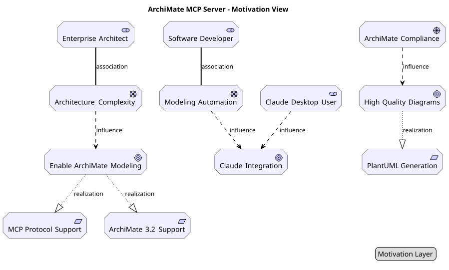
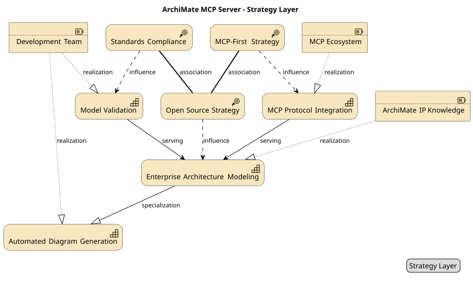
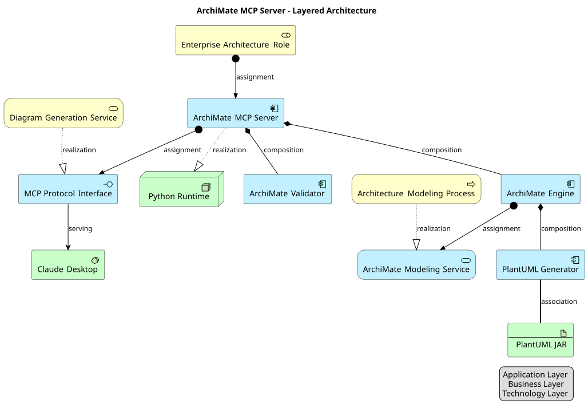
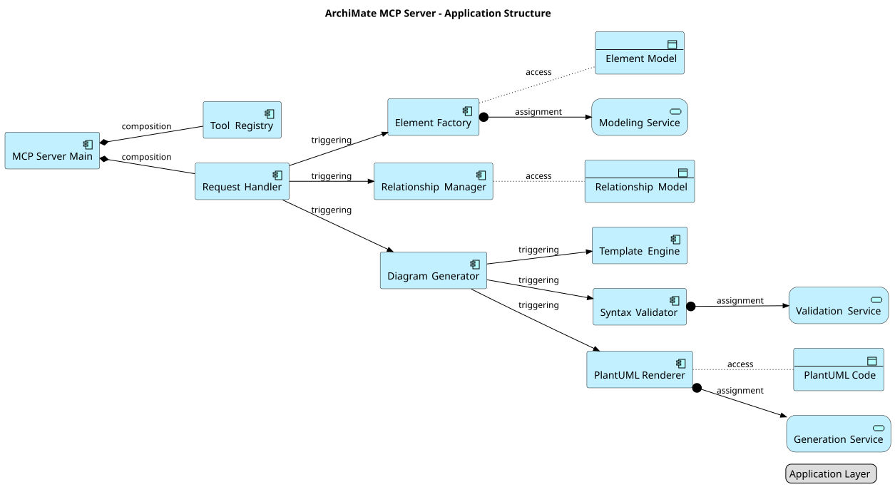
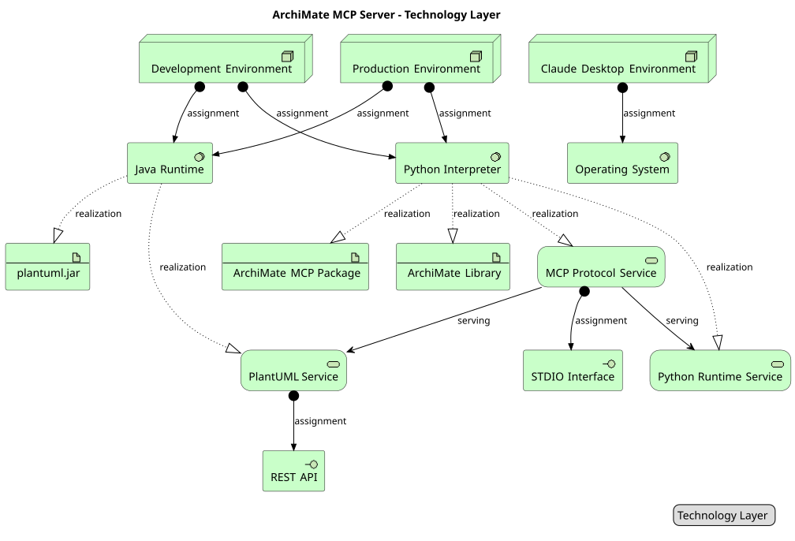
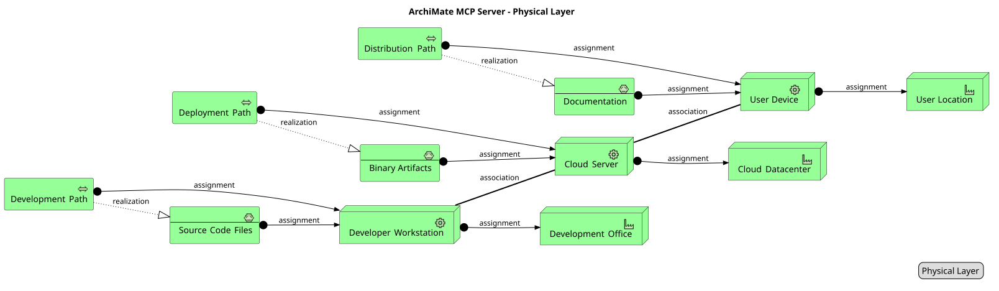
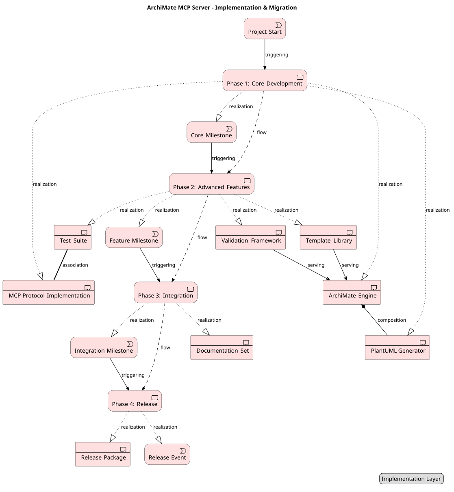
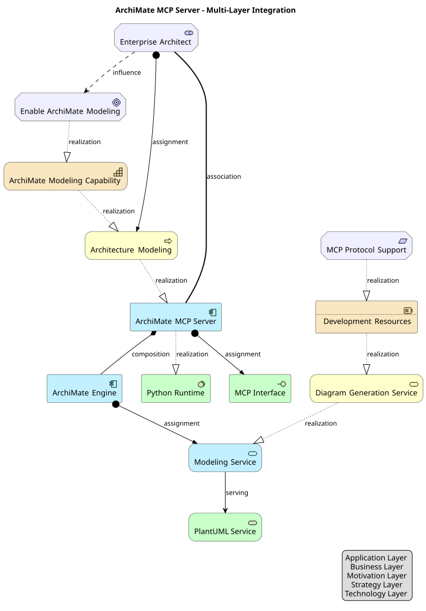

# ArchiMate MCP Server

[](https://www.python.org/downloads/)
[](https://opensource.org/licenses/MIT)
[](https://github.com/astral-sh/uv)

A specialized MCP (Model Context Protocol) server for generating PlantUML ArchiMate diagrams with comprehensive enterprise architecture modeling support.

> **🎯 Live Architecture Demo**: This repository includes a complete architectural blueprint of the ArchiMate MCP Server itself, spanning all 7 ArchiMate layers with 8 coordinated views. See the generated diagrams below for a real-world demonstration of the tool's capabilities.

## 🏗️ Overview

ArchiMate MCP Server fills a crucial gap in the MCP ecosystem by providing dedicated support for ArchiMate enterprise architecture modeling. While existing MCP servers offer general UML diagram generation, this server focuses specifically on ArchiMate 3.2 specification compliance with full support for all layers, elements, and relationships.

### Key Features (Simplified API)

- **Complete ArchiMate 3.2 Support**: All 55+ elements across 7 layers
- **Intelligent Input Normalization**: Case-insensitive inputs with automatic correction
- **Built-in Validation**: Comprehensive PlantUML and ArchiMate validation
- **PNG Generation**: Local file generation with macOS-optimized headless mode
- **5 Focused Tools**: Streamlined API for core diagram creation and analysis
- **FastMCP 2.8+ Integration**: Modern MCP protocol implementation
- **Robust Testing**: 181 passing tests with comprehensive coverage

## 🚀 Quick Start

### Installation

```bash
# Install with uv (recommended)
uv add archi-mcp

# Or install with pip
pip install archi-mcp
```

### Claude Desktop Configuration

**Setup**: Add to your Claude Desktop configuration file:

**macOS**: `~/Library/Application Support/Claude/claude_desktop_config.json`
**Windows**: `%APPDATA%\Claude\claude_desktop_config.json`

```json
{
  "mcpServers": {
    "archi-mcp": {
      "command": "uv",
      "args": ["run", "--directory", "/path/to/your/archi-mcp", "python", "-m", "archi_mcp.server"],
      "cwd": "/path/to/your/archi-mcp",
      "env": {
        "ARCHI_MCP_LOG_LEVEL": "INFO",
        "ARCHI_MCP_STRICT_VALIDATION": "true"
      }
    }
  }
}
```

**📖 Complete Setup Guide**: See [CLAUDE_DESKTOP_SETUP.md](docs/CLAUDE_DESKTOP_SETUP.md) for detailed configuration options and troubleshooting.

### Basic Usage

Once configured, you can use ArchiMate MCP Server through Claude Desktop:

**Basic Diagram Generation:**
```
Create an ArchiMate diagram showing a three-tier architecture with:
- A business service layer
- An application component layer  
- A technology infrastructure layer
Include the relationships between these layers.
```

**Full Architecture Generation (NEW!):**
```
Generate a complete enterprise architecture for an online banking portal 
including motivation view, layered view, application structure, and 
implementation roadmap with 4 phases.
```

The full architecture generator follows the **ArchiMate Cookbook methodology** and automatically creates multiple coordinated views with proper element relationships and business domain context.

## 🏛️ Complete Architecture Demonstration

This repository showcases a comprehensive architectural blueprint of the ArchiMate MCP Server itself, demonstrating all 7 ArchiMate layers across 8 coordinated views:

### 🎯 **Motivation Layer** 

- **Stakeholders**: Enterprise Architect, Software Developer, Claude Desktop User
- **Drivers**: Architecture Complexity, ArchiMate Compliance, Modeling Automation
- **Goals**: Enable ArchiMate Modeling, Claude Integration, High Quality Diagrams
- **Requirements**: MCP Protocol Support, ArchiMate 3.2 Support, PlantUML Generation

### 📋 **Strategy Layer**

- **Resources**: ArchiMate IP Knowledge, Development Team, MCP Ecosystem
- **Capabilities**: Enterprise Architecture Modeling, Automated Diagram Generation, MCP Protocol Integration
- **Courses of Action**: Open Source Strategy, MCP-First Strategy, Standards Compliance

### 🏗️ **Layered Architecture**

- **Business Layer**: EA Role, Modeling Process, Diagram Service
- **Application Layer**: MCP Server, ArchiMate Engine, PlantUML Generator, Validator
- **Technology Layer**: Python Runtime, PlantUML JAR, Claude Desktop

### 💻 **Application Structure**

- **Components**: MCP Server Main, Tool Registry, Request Handler, Element Factory, Relationship Manager
- **Services**: Modeling Service, Validation Service, Generation Service
- **Data Objects**: Element Model, Relationship Model, PlantUML Code

### ⚙️ **Technology Infrastructure**

- **System Software**: Python Interpreter, Java Runtime, Operating System
- **Nodes**: Development Environment, Production Environment, Claude Desktop Environment
- **Services**: MCP Protocol Service, PlantUML Service, Python Runtime Service

### 🏗️ **Physical Infrastructure**

- **Equipment**: Developer Workstation, Cloud Server, User Device
- **Facilities**: Development Office, Cloud Datacenter, User Location
- **Distribution Networks**: Development Path, Deployment Path, Distribution Path

### 🚀 **Implementation Roadmap**

- **4 Development Phases**: Core Development, Advanced Features, Integration, Release
- **Key Deliverables**: MCP Protocol Implementation, ArchiMate Engine, Validation Framework
- **Milestone Events**: Project Start, Core Milestone, Feature Milestone, Release Event

### 🔗 **Multi-Layer Integration**

- **Cross-layer Relationships**: End-to-end traceability from stakeholder goals to technical implementation
- **Integration Points**: How motivation drives strategy, which shapes business processes, realized by applications, running on technology

> **💡 Architecture Generation**: All these diagrams were generated using the ArchiMate MCP Server itself, demonstrating real-world application of the tool's capabilities and validating its production readiness.

## 🏛️ ArchiMate Support

### Supported Layers

- **Business Layer**: Actors, roles, processes, services, objects
- **Application Layer**: Components, services, interfaces, data objects
- **Technology Layer**: Nodes, devices, software, networks, artifacts
- **Physical Layer**: Equipment, facilities, distribution networks, materials
- **Motivation Layer**: Stakeholders, drivers, goals, requirements, principles
- **Strategy Layer**: Resources, capabilities, courses of action, value streams
- **Implementation Layer**: Work packages, deliverables, events, plateaus, gaps

### Supported Relationships

All 12 ArchiMate relationship types with directional variants:
- Access, Aggregation, Assignment, Association
- Composition, Flow, Influence, Realization
- Serving, Specialization, Triggering

### Junction Support

- And/Or junctions for complex relationship modeling
- Grouping and nesting capabilities

## 🛠️ MCP Tools

The server provides 7 comprehensive MCP tools:

### 1. `create_archimate_diagram`
Generate complete ArchiMate diagrams from structured input.

```json
{
  "elements": [
    {
      "id": "customer_service",
      "name": "Customer Service",
      "element_type": "Business_Service",
      "layer": "Business"
    }
  ],
  "relationships": [],
  "title": "Customer Service Architecture"
}
```

### 2. `add_archimate_element`
Add individual elements to existing diagrams.

```json
{
  "element_type": "Application_Component",
  "id": "crm_system", 
  "name": "CRM System",
  "layer": "Application"
}
```

### 3. `add_archimate_relationship`
Create relationships between elements.

```json
{
  "id": "realization_rel",
  "from_element": "crm_system",
  "to_element": "customer_service", 
  "relationship_type": "Realization"
}
```

### 4. `validate_archimate_model`
Validate models against ArchiMate 3.2 specification.

```json
{
  "strict": true
}
```

### 5. `generate_archimate_template`
Generate diagrams from predefined templates.

```json
{
  "template_type": "viewpoint",
  "template_name": "layered",
  "customization": {}
}
```

Export diagrams to PlantUML format with optional file output.

```json
{
  "title": "Enterprise Architecture",
  "output_path": "./diagrams/architecture.puml"
}
```

### 7. `generate_full_architecture`
Generate complete layered enterprise architecture following ArchiMate methodology with multiple coordinated views.

```json
{
  "system_description": "Online banking portal with mobile app and web interface",
  "business_domain": "banking",
  "architecture_scope": "system", 
  "include_views": ["motivation", "layered_view", "application_structure", "implementation_roadmap"],
  "implementation_phases": 4
}
```

This tool implements the **ArchiMate Cookbook methodology** and generates:
- **Motivation View** - stakeholders, drivers, goals, requirements
- **Business Model Canvas** - business logic and value propositions  
- **Value Stream View** - customer value generation via capabilities
- **Strategy & Capability Views** - goal-to-capability mapping
- **Layered Views** - business, application, technology structure
- **Interaction Views** - actor, process, application interactions
- **Application & Technology Structure** - detailed component breakdowns
- **Implementation Roadmap** - phased delivery timeline

## 📚 Templates

### ArchiMate Viewpoints
- **Layered**: Cross-layer relationships and dependencies
- **Service Realization**: How services are realized by components
- **Application Cooperation**: Application component interactions
- **Technology Usage**: Infrastructure and technology stack
- **Motivation**: Stakeholders, drivers, goals, and requirements

### Architecture Patterns
- **Three-Tier Architecture**: Presentation, business logic, data layers
- **Microservices**: Service-oriented architecture with API gateway
- **Event-Driven**: Event producers, consumers, and message flows
- **Layered Service**: Service-oriented layered architecture
- **CQRS**: Command Query Responsibility Segregation pattern

### Industry Templates
- **Banking**: Core banking system architecture
- **E-commerce**: Online retail platform architecture
- **Healthcare**: Hospital information system architecture
- **Manufacturing**: Manufacturing execution system (MES)

## 🧪 Development

### Requirements

- Python 3.11+
- uv (recommended) or pip
- Git

### Development Setup

```bash
# Clone the repository
git clone https://github.com/pskovajsa/archi-mcp.git
cd archi-mcp

# Install development dependencies
uv sync --dev

# Run tests
uv run pytest

# Run tests with coverage
uv run pytest --cov=archi_mcp --cov-report=html

# Code formatting
uv run black src tests
uv run isort src tests

# Type checking
uv run mypy src

# Linting
uv run ruff src tests
```

### Project Structure

```
archi-mcp/
├── src/archi_mcp/           # Main package
│   ├── archimate/           # ArchiMate modeling components
│   │   ├── elements/        # Element definitions by layer
│   │   ├── relationships.py # Relationship types and validation
│   │   ├── generator.py     # PlantUML code generation
│   │   └── validator.py     # Model validation
│   ├── templates/           # Template library
│   │   ├── viewpoints.py    # ArchiMate viewpoints
│   │   ├── patterns.py      # Architecture patterns
│   │   └── industry.py      # Industry-specific templates
│   ├── utils/               # Utilities
│   └── server.py           # MCP server implementation
├── tests/                   # Comprehensive test suite
├── examples/               # Usage examples
└── docs/                   # Documentation
```

## 📁 Complete Documentation

### Architecture Documentation
- **[ARCHITECTURE_OVERVIEW.md](docs/ARCHITECTURE_OVERVIEW.md)**: Executive summary and high-level architectural vision
- **[ARCHITECTURE.md](docs/ARCHITECTURE.md)**: Complete architectural analysis across all 7 ArchiMate layers
- **[VIEWING_GUIDE.md](docs/VIEWING_GUIDE.md)**: Comprehensive guide for viewing and working with generated diagrams

### Setup and Configuration
- **[CLAUDE_DESKTOP_SETUP.md](docs/CLAUDE_DESKTOP_SETUP.md)**: Complete Claude Desktop configuration guide with troubleshooting
- **[CLAUDE.md](CLAUDE.md)**: Development instructions and project guidelines for Claude

### Generated Diagrams
All architectural views are available in both PlantUML source (`.puml`) and SVG format (`.svg`):
- `examples/diagrams/archi_mcp_motivation.puml` / `docs/diagrams/archi_mcp_motivation.svg` - Motivation Layer
- `examples/diagrams/archi_mcp_strategy_layer.puml` / `docs/diagrams/archi_mcp_strategy_layer.svg` - Strategy Layer  
- `examples/diagrams/archi_mcp_layered_architecture.puml` / `docs/diagrams/archi_mcp_layered_architecture.svg` - Layered Architecture
- `examples/diagrams/archi_mcp_application_structure.puml` / `docs/diagrams/archi_mcp_application_structure.svg` - Application Structure
- `examples/diagrams/archi_mcp_technology_layer.puml` / `docs/diagrams/archi_mcp_technology_layer.svg` - Technology Infrastructure
- `examples/diagrams/archi_mcp_physical_layer.puml` / `docs/diagrams/archi_mcp_physical_layer.svg` - Physical Infrastructure
- `examples/diagrams/archi_mcp_implementation_migration.puml` / `docs/diagrams/archi_mcp_implementation_migration.svg` - Implementation Roadmap
- `examples/diagrams/archi_mcp_multi_layer_integration.puml` / `docs/diagrams/archi_mcp_multi_layer_integration.svg` - Multi-Layer Integration

> **💡 Self-Generated**: All these diagrams were created using the ArchiMate MCP Server itself, proving the tool's real-world capabilities and production readiness.

## 📖 Examples

### Basic Three-Tier Architecture

```python
from archi_mcp.archimate.elements import BusinessElement, ApplicationElement, TechnologyElement
from archi_mcp.archimate.relationships import create_relationship
from archi_mcp.archimate.generator import ArchiMateGenerator

# Create elements
business_service = BusinessElement.create_business_service(
    id="customer_service",
    name="Customer Service"
)

app_component = ApplicationElement.create_application_component(
    id="web_app", 
    name="Web Application"
)

tech_node = TechnologyElement.create_node(
    id="app_server",
    name="Application Server"
)

# Create relationships
app_realizes_business = create_relationship(
    "realizes_1", "web_app", "customer_service", "Realization"
)

server_hosts_app = create_relationship(
    "hosts_1", "app_server", "web_app", "Assignment"
)

# Generate diagram
generator = ArchiMateGenerator()
generator.add_element(business_service)
generator.add_element(app_component)
generator.add_element(tech_node)
generator.add_relationship(app_realizes_business)
generator.add_relationship(server_hosts_app)

plantuml_code = generator.generate_plantuml(title="Three-Tier Architecture")
print(plantuml_code)
```

### Using Templates

```python
from archi_mcp.templates import get_pattern_template
from archi_mcp.archimate.generator import ArchiMateGenerator

# Load microservices pattern template
template = get_pattern_template("microservices")

# Create generator and apply template
generator = ArchiMateGenerator()

# Add elements from template
for elem_data in template.elements:
    element = create_element_from_template(elem_data)
    generator.add_element(element)

# Add relationships from template  
for rel_data in template.relationships:
    relationship = create_relationship_from_template(rel_data)
    generator.add_relationship(relationship)

# Generate PlantUML
plantuml_code = generator.generate_plantuml(title=template.name)
```

## 🔧 Configuration

### Environment Variables

- `ARCHI_MCP_LOG_LEVEL`: Logging level (DEBUG, INFO, WARNING, ERROR)
- `ARCHI_MCP_LOG_FILE`: Optional log file path
- `ARCHI_MCP_STRICT_VALIDATION`: Enable strict ArchiMate validation

### Custom Templates

You can extend the template library by creating custom templates:

```python
from archi_mcp.templates.patterns import PatternTemplate

custom_pattern = PatternTemplate(
    name="Custom Pattern",
    description="My custom architecture pattern", 
    elements=[...],
    relationships=[...],
    pattern_type="custom"
)
```

## 🤝 Contributing

Contributions are welcome! Please read our [Contributing Guide](CONTRIBUTING.md) for details on:

- Code style and standards
- Submitting pull requests
- Reporting issues
- Adding new templates
- Extending ArchiMate support

## 📄 License

This project is licensed under the MIT License - see the [LICENSE](LICENSE) file for details.

## 🙏 Acknowledgments

- [ArchiMate® 3.2 Specification](https://www.opengroup.org/archimate-forum/archimate-overview) by The Open Group
- [PlantUML](https://plantuml.com/) for diagram generation capabilities
- [Model Context Protocol (MCP)](https://modelcontextprotocol.io/) for enabling AI assistant integration
- [Anthropic](https://www.anthropic.com/) for Claude and MCP development

## 📞 Support

- **Issues**: [GitHub Issues](https://github.com/entira/archi-mcp/issues)
- **Discussions**: [GitHub Discussions](https://github.com/entira/archi-mcp/discussions)
- **Documentation**: [Project Wiki](https://github.com/entira/archi-mcp/wiki)

## 🗺️ Roadmap

- [ ] Export to ArchiMate Open Exchange Format
- [ ] Advanced model analysis and metrics
- [ ] Collaborative modeling features

---

**ArchiMate MCP Server** - Bridging enterprise architecture modeling and AI assistance through the Model Context Protocol.